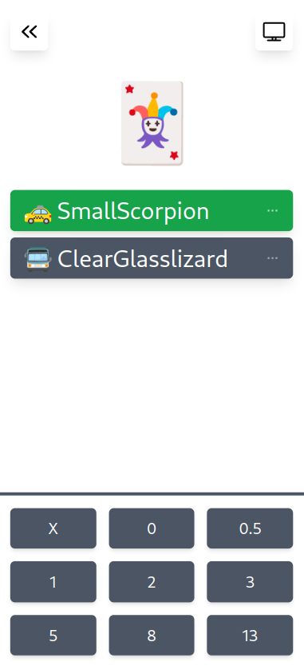

# 🃏 Planning Poker

Play planning poker with websockets in realtime with minimal ui.

### Features

- Join a unique room and vote using the buttons at the bottom of the screen
- Viewer mode allows you to join a room but just watch the planning (by clicking on the tv)
- Toggle if the planning is visible for hidden (by clicking on the joker)
- See when other members have chosen a value
- no signup or user creation needed
- set username by clicking on yourself in the green box



### Developing

Launch with docker compose

```shell
docker compose up
```

Visit http://localhost

In development, the api container will watch for file changes to .go files and recompile to backend each time a file is changed.
The web container will also watch for file changes and hot reload components in your browser.